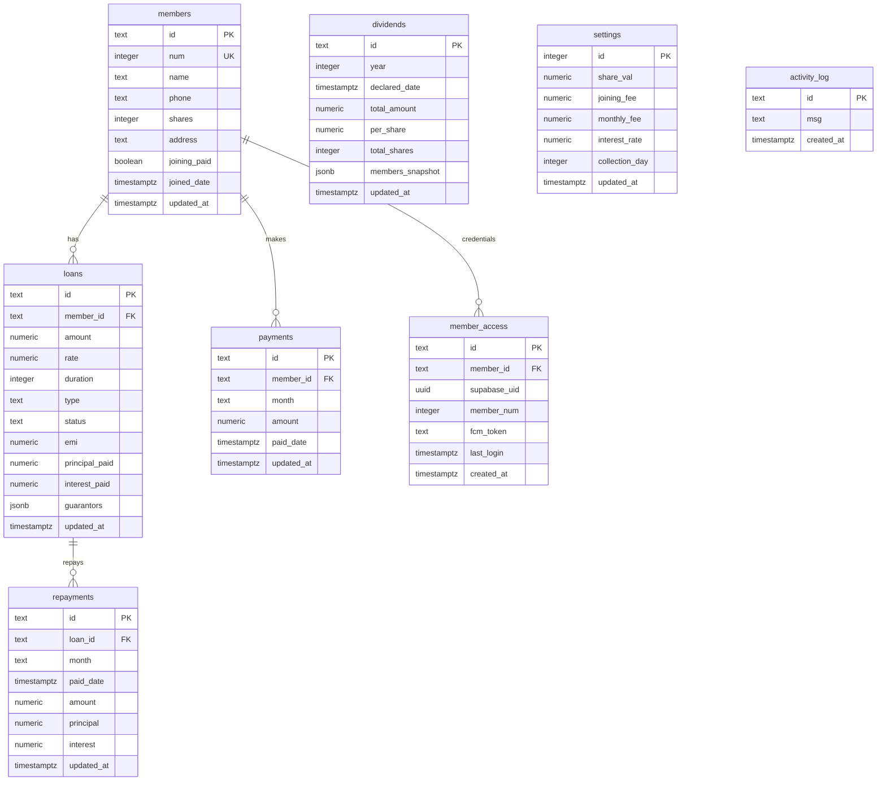

# Entity Relationship Diagram (ERD)

This document describes the relational database schema design for the **Umiya Bachat Mandal** application.

## Schema Details & Constraints

1. **`members`**: Holds information about each member.
   * `num` has a `UNIQUE` constraint to guarantee sequence integrity.
2. **`loans`**: Holds information about loans granted to members.
   * `member_id` is a Foreign Key referencing `members(id)`.
   * Has a `CHECK` constraint restricting types to `FLAT_EMI` and `INTEREST_ONLY`.
3. **`payments`**: Records monthly savings contributions (Hato).
   * `member_id` is a Foreign Key referencing `members(id)`.
4. **`repayments`**: Records EMI payments against specific loans.
   * `loan_id` is a Foreign Key referencing `loans(id)`.
5. **`member_access`**: Links Supabase authentication users (`auth.users`) to application members.
   * `member_id` is a Foreign Key referencing `members(id)` with a `UNIQUE` constraint (1-to-1 relationship).
6. **`settings`**: Single-row configuration table.
   * The `id` is primary key defaulted to `1` with an implicit constraint restricting it to exactly one row.
